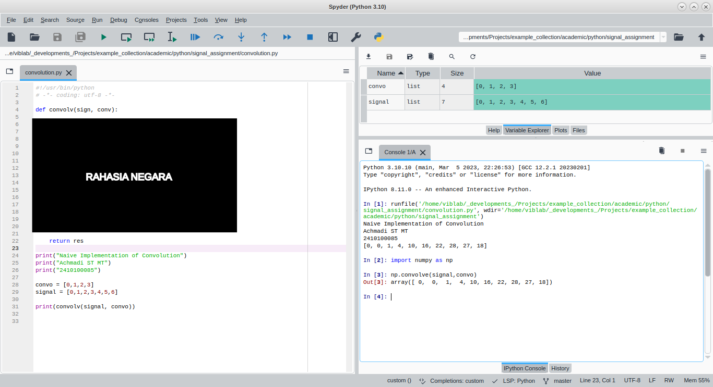

# Signal Class Assigment Guides

This repository is an example for Convolution assignment.

## Assignment Rules

Here some rules:
- Implement a Convolution of two 1-dimensional array signals.
- Using only basic Python **WITHOUT** available modules (no NumPy, no SciPy, etc)
- Only use NumPy Convolve to validate the result
- Upload your work on your Github Account
	+ Screenshot the Spyder or Jupyter with name and NRP shown in the image.
	+ Your original Python script.
	+ Readme for brief explanation.
	+ Submission date will be checked on Github's commit logs.
- No verbatim copy from others work
	+ if found, both work will be discarded.

---

## Submission Result
- [Submit Form](https://docs.google.com/forms/d/e/1FAIpQLSf2rh-MH9hFuCRdrGVdAGDormalTQZjabJNwtn7J-OcZohZFQ/viewform)
- [Result Table](https://github.com/mekatronik-achmadi/tugas-sinyal/blob/main/Tugas_Python_2/results.md)

---

## Example Result

Actual Example of Python Script: [Gist](https://gist.github.com/mekatronik-achmadi/3b740945961aae401cc315ca9d441d9b)
