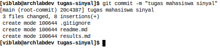

# Signal Class Assigment Guides

This repository is an example for assignment.
You may read through all this guide document or you can just jump into expected result in this [section](https://github.com/mekatronik-achmadi/tugas-sinyal/tree/main#example-result).

## Contents
- [Result Table](https://github.com/mekatronik-achmadi/tugas-sinyal/tree/main#result-table)
- [Guides](https://github.com/mekatronik-achmadi/tugas-sinyal/tree/main#guides)
	+ [Windows Install](https://github.com/mekatronik-achmadi/tugas-sinyal/tree/main#install-necessary-on-windows)
	+ [Git ID](https://github.com/mekatronik-achmadi/tugas-sinyal/tree/main#git-id)
	+ [Github Repository](https://github.com/mekatronik-achmadi/tugas-sinyal/tree/main#github-repository)
	+ [Github Workflow](https://github.com/mekatronik-achmadi/tugas-sinyal/tree/main#github-workflow)
---

## Result Table

Here list of acknowledged and checked work results: [Tables](https://github.com/mekatronik-achmadi/tugas-sinyal/blob/main/results.md).

---

## Guides

### Install Necessary on Windows

#### Git/Github
- [Windows Installation](https://github.com/mekatronik-achmadi/md_tutorial/blob/master/pelatihan/install_git.md)
- [Github Registration](https://github.com/mekatronik-achmadi/md_tutorial/blob/master/pelatihan/github_signup.md)
- [Classic Token](https://github.com/mekatronik-achmadi/md_tutorial/blob/master/electronic/tutorials/github_token.md)

#### Python
- [Windows Python](https://github.com/mekatronik-achmadi/md_tutorial/blob/master/pelatihan/install_python.md#python-installer)
- Install required modules:

```sh
pip install numpy matplotlib spyder
```

#### Markdown Editor

You can install Notepad++ editor on Markdown Editor (*.md) to edit your README or readme.md file.
You can download Notepad++ installer [here](https://notepad-plus-plus.org/downloads/).

---

### Git ID

Copy and paste these commands on Git Bash:

```sh
git config --global user.name "Nama Anda"
git config --global user.email "email.anda@gmail.com"
```

---

### Github Repository

**Note:** This section only need to done once each project repository

Create new empty Github repository with your preferred name:


Resulting like this:


Now, on your project folder, open **Git-Bash** there and run this to initiate the folder as Git folder

```sh
git init
```

Add your own project repository on your Github as remote, using command

```sh
git remote add origin https://github.com/nama-akun-anda/nama-repo-anda.git
```

**Note:** You may add ".git" suffix at the end of your remote URL if not already.

---

### Github Workflow

**Note:** This section can be done repeatedly on each project repository on **Git-Bash**

First, check changed or new files using command:

```sh
git status
```

Now, you can record your files changes using command:

```sh
git add *
```

Then you can check again:

```sh
git status
```

Next, you can freeze the record using command:

```sh
git commit -m "pesan catatan"
```



**Note:** The red-squared show your current project branch name

Then you can check again:

```sh
git status
```

Then you can send your freezed record to your Github project using command:

```sh
git push -u origin main
```

**Note:** You need your Github username and either password or access-token.

---

## Example Result

### A. IPython Console from Spyder showing Name and Registration number

```py
print("Nama: Achmadi")
print("NRP: 2410100085")
```


### B. Plot Result on Spyder which your own Python script run

### C. Python script restrictions
- Implementing any Signal Processing like Filtering, FFT, Convolution/Modulation, etc.
- Only use Numpy and Matplotlib modules.
- Use minimal internal Numpy functions like numpy.fft, numpy.convolve, etc.
- No verbatim copies from other's work.