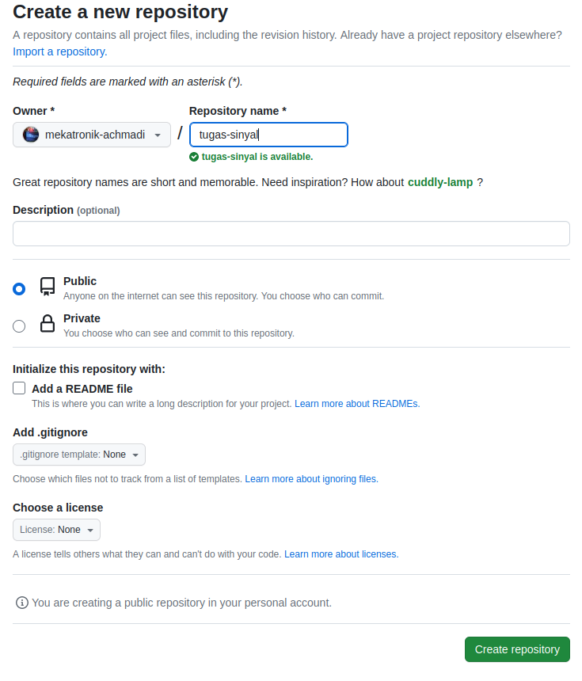

# Signal Class Assigment Guides

This repository is an example for assignment.
You may read through all this guide document or you can just jump into expected result in this [section](https://github.com/mekatronik-achmadi/tugas-sinyal/tree/main#example-result).

## Contents
- [Result Table](https://github.com/mekatronik-achmadi/tugas-sinyal/tree/main#result-table)
- [Guides](https://github.com/mekatronik-achmadi/tugas-sinyal/tree/main#guides)
	+ [Windows Install](https://github.com/mekatronik-achmadi/tugas-sinyal/tree/main#install-necessary-on-windows)
	+ []

## Result Table

Here list of acknowledged and checked work results: [Tables](https://github.com/mekatronik-achmadi/tugas-sinyal/blob/main/results.md).

## Guides

### Install Necessary on Windows

#### Git/Github
- [Windows Installation](https://github.com/mekatronik-achmadi/md_tutorial/blob/master/pelatihan/install_git.md)
- [Github Registration](https://github.com/mekatronik-achmadi/md_tutorial/blob/master/pelatihan/github_signup.md)
- [Classic Token](https://github.com/mekatronik-achmadi/md_tutorial/blob/master/electronic/tutorials/github_token.md)

#### Pyhon
- [Windows Python](https://github.com/mekatronik-achmadi/md_tutorial/blob/master/pelatihan/install_python.md#python-installer)
- Install required modules:

```sh
pip install numpy matplotlib spyder
```

#### Markdown Editor

You can install Notepad++ editor on Markdown Editor (*.md) to edit your README or readme.md file.
You can download Notepad++ installer [here](https://notepad-plus-plus.org/downloads/).

### Git ID

Copy and paste these commands on Git Bash:

```sh
git config --global user.name "Nama Anda"
git config --global user.email "email.anda@gmail.com"
```

### Github Repository

**Note:** This section only need to done once each project repository

Create new empty Github repository with your preferred name:



Resulting like this:


Now, on your project folder, open Git-Bash there and run this to initiate the folder as Git folder

```sh
git init
```

### Github Workflow

## Example Result

