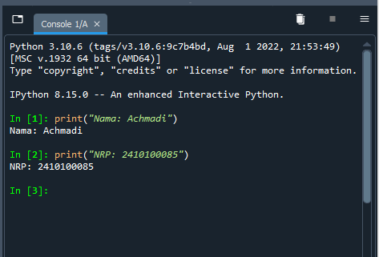

# Signal Class Assigment Guides

This repository is an example for assignment.
You may read through all this guide document or you can just jump into expected result in this [section](https://github.com/mekatronik-achmadi/tugas-sinyal/tree/main#example-result).

## Contents
- [Result Table](https://github.com/mekatronik-achmadi/tugas-sinyal/tree/main#result-table)
- [Guides](https://github.com/mekatronik-achmadi/tugas-sinyal/tree/main#guides)
- [Result Example]()
	
---

## Result Table

Here list of acknowledged and checked work results: [Tables](https://github.com/mekatronik-achmadi/tugas-sinyal/blob/main/results.md).

---

## Guides

Preparation Guidance can be checked [here](https://github.com/mekatronik-achmadi/tugas-sinyal/blob/main/guides.md).

---

## Example Result

### A. IPython Console from Spyder showing Name and Registration number

```py
print("Nama: Achmadi")
print("NRP: 2410100085")
```



### B. Plot Result on Spyder which your own Python script run

### C. Python script restrictions
- Implementing any Signal Processing like Filtering, FFT, Convolution/Modulation, etc.
- Only use Numpy and Matplotlib modules.
- Use minimal internal Numpy functions like numpy.fft, numpy.convolve, etc.
- No verbatim copies from other's work.